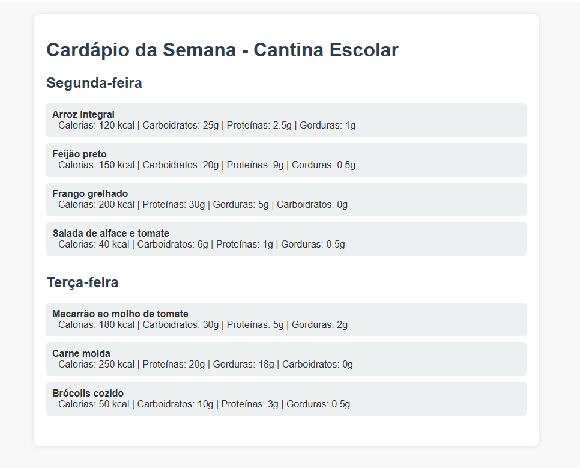

# 🥗 Cardápio Digital da Cantina

Sistema simples e acessível para exibir o **cardápio semanal da cantina**, com foco em informações nutricionais, organização visual e boa experiência para alunos, professores e equipe de cozinha.



---

## 📚 Visão Geral

Este projeto foi desenvolvido para permitir que escolas ou instituições possam exibir, de forma digital e estruturada, os alimentos servidos durante a semana, incluindo:

- Cardápio separado por dias
- Informações nutricionais por item
- Estrutura responsiva e acessível
- Layout leve e personalizável
- Fluxo de desenvolvimento controlado com GitHub Flow

---

## 🚀 Como Usar

1. Clone o repositório:
   ```bash
   git clone https://github.com/seu-usuario/cardapio-cantina.git
   cd cardapio-cantina


2. Abra o arquivo index.html no navegador.

3. Edite os arquivos conforme a necessidade:
    - index.html: estrutura e conteúdo do cardápio
    - estilo.css: estilos visuais
    - WORKFLOW.md: normas de colaboração no projeto

## 🛠️ Tecnologias Utilizadas
| Tecnologia   | Finalidade                          |
| ------------ | ----------------------------------- |
| HTML5        | Estrutura do cardápio               |
| CSS3         | Estilização do layout               |
| Markdown     | Documentação (`README`, `WORKFLOW`) |
| Git & GitHub | Versionamento e colaboração         |

✨ Funcionalidades
 - Cardápio separado por dia
 - Informações nutricionais organizadas
 - Estrutura de projeto documentada
 - Estilo CSS modular
 - Fluxo de trabalho padronizado (GitHub Flow)
 - Suporte a múltiplos idiomas (em breve)
 - Tema escuro (em breve)

📂 Estrutura do Projeto
```bash
    ├── index.html         # Página principal do cardápio
    ├── estilo.css         # Estilos visuais
    ├── README.md          # Este arquivo
    ├── WORKFLOW.md        # Documentação do fluxo de trabalho
```

## 🤝 Contribuindo
#### Quer contribuir? Ótimo! Siga estas etapas:
1. Crie um fork do projeto.
2. Crie uma branch:
    ```bash
    git checkout -b feature/nome-da-sua-funcionalidade
    ```
3. Commit seguindo o padrão semântico.
4. Faça um Pull Request explicando suas mudanças.

👉 Consulte o <a href='https://github.com/MarxWesley/devopsClass/blob/main/workflow.md' alt='link workflow'>WORKFLOW.md</a>
 para mais detalhes sobre o processo de desenvolvimento, revisão e integração.

## 👨‍🏫 Créditos

- Desenvolvido por Equipe dos Mano.
- Idealizado para uso educacional e institucional.

---